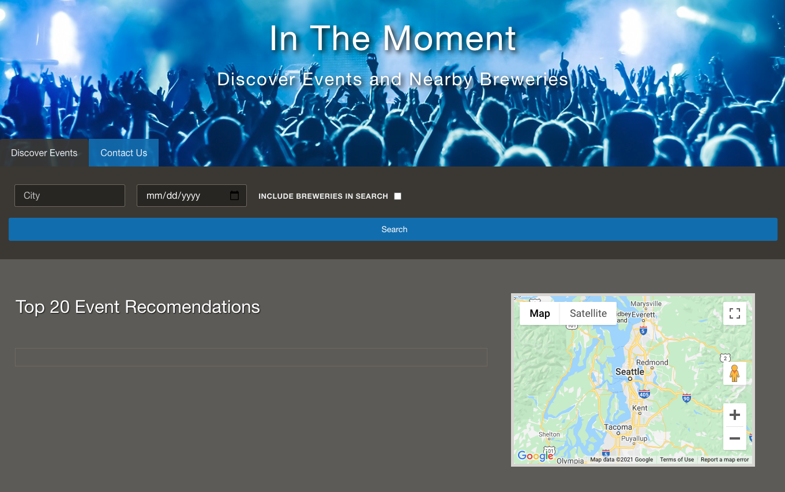
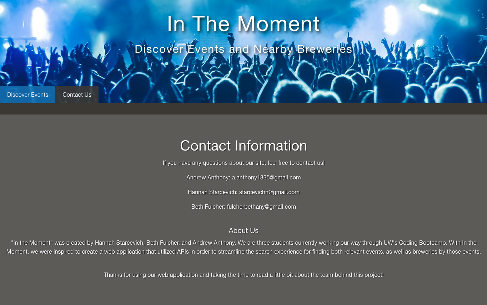

# In_The_Moment #
Discover events and breweries in the US by city. 
* Created By: Andrew Ma Anthony, Beth Fulcher, Hannah Starcevich
* Deployed Site: https://andrew1835.github.io/In_The_Moment/
* Git Hub Link: https://github.com/andrew1835/In_The_Moment

### Web Application Description: ###

* Search for events in a specific city or location
* Select the date of the event
* Select the option to include breweries near by the event venue
* Map Key: 
    * Red marker: City or event location
    * Blue marker: Brewery location, hover over marker for brewery name

### Motivation for Development: ###

* Our goal is to make planning an event outing an easy and enjoyable experience
* Avoid driving to numerous areas in one night 

### User Story: ###

* AS A Live event enthusiast and beer lover
* I WANT to discover events and breweries near the event venue
* SO THAT I can enjoy the event and a great brew

### Technologies Used: ###
* HTML, GitHub, CSS, CSS Framework: Foundation 
* JavaScript, jQuery, APIs, AJAX, JSON
* APIs: Ticketmaster, Open Brewery DB & Google Maps 

### Screenshots: ###

* This first screenshot is of the Application's home page when you open it for the first time

* The second screenshot shows what happens when you search for events in Seattle around the date of February 18th and have checked the box for breweries. As you can see, a list of events with relevant event information appears, and the map is populated with blue pins to mark the location of breweries in the event area.

* This final screenshot shows the content on the Contact Us page

